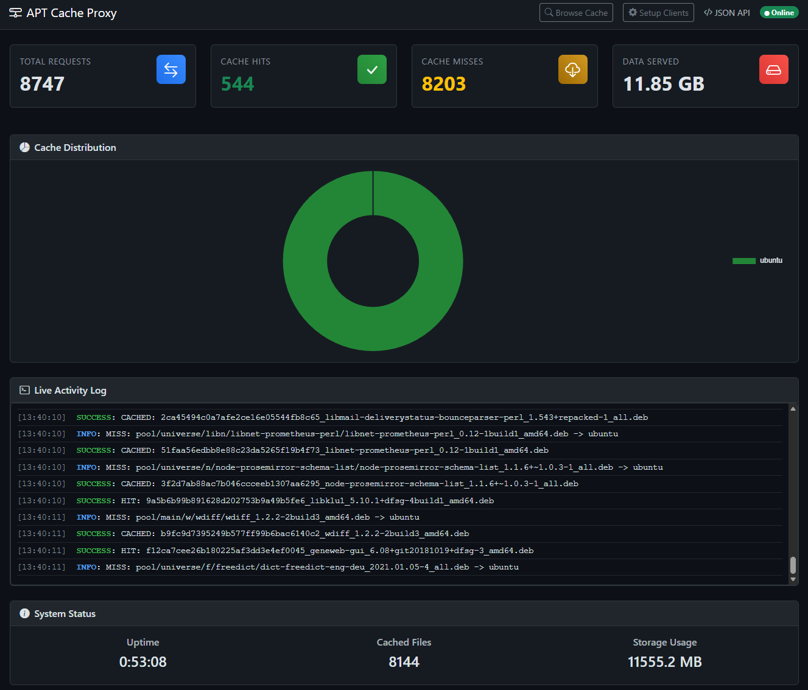
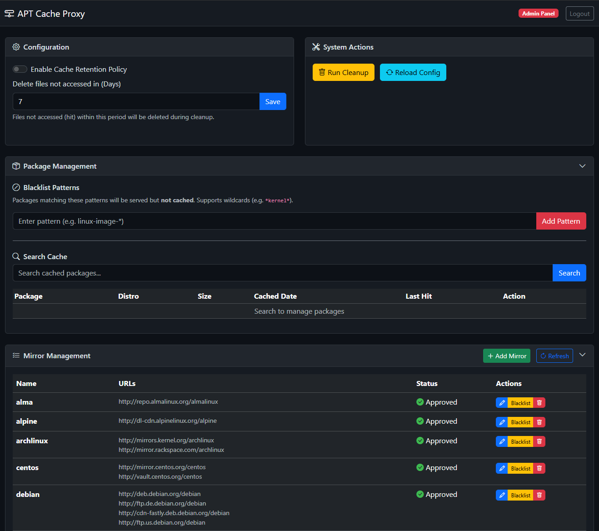

# APT Cache Proxy

A modern, lightweight APT caching proxy server written in Python. It caches packages from upstream mirrors to save bandwidth and speed up package installation on your local network. It is designed to be a drop-in replacement for `apt-cacher-ng` in many scenarios.

## Features

- **Dynamic Caching**: Caches packages on demand from multiple upstream mirrors.
- **Dynamic Mirror Discovery**: Automatically learns and caches new HTTP repositories accessed via the proxy.
- **Multi-Distro Support**: Supports Debian, Ubuntu, Fedora, CentOS, Rocky Linux, AlmaLinux, OpenSUSE, Kali Linux, Arch Linux, Alpine, Docker, and more out of the box.
- **HTTPS Tunneling**: Transparently tunnels HTTPS traffic (CONNECT method) for repositories that cannot be cached (e.g., official Docker/NVIDIA repos).
- **Web Dashboard**: Public, read-only real-time dashboard to monitor cache hits, misses, bandwidth usage, and storage distribution.
- **Admin Panel**: Secure web interface to manage mirrors, packages, and configuration.
- **Persistent Statistics**: Statistics are saved to a SQLite database, so they persist across restarts.
- **Automatic Cleanup**: Background task automatically removes cache files older than the configured retention period (default: 7 days).
- **Package Blacklisting**: Prevent specific packages from being cached (served directly from upstream).
- **Manual Caching**: Manually download and cache specific packages via the admin panel.
- **Hot Reload**: Update configuration without restarting the server using the `/reload` endpoint (Authenticated).
- **Cross-Platform**: Runs on Linux and Windows.

## Dashboard & Admin Panel

- **Public Dashboard**: `http://<your-proxy-ip:port>`
- **Admin Panel**: `http://<your-proxy-ip:port>/admin`



Use the `admin_token` from `data/config.json` to log in to the admin panel.



### Admin Features
- **Mirror Management**: Add, edit, delete, approve, or blacklist upstream mirrors.
- **Package Management**: Search for cached packages, view details (size, cached date, last hit), and delete specific files.
- **Manual Caching**: Search for packages on upstream mirrors and manually trigger a download to the cache.
- **Blacklist**: Add patterns (e.g., `*kernel*`) to prevent specific packages from being cached.
- **Configuration**: Toggle cache retention policy and set retention days.
- **System Actions**: Manually trigger cache cleanup or reload configuration.

## Prerequisites

- Python 3.8+ (for manual installation)
- OR Docker / Docker Compose

## Docker Installation (Recommended)

### Using Docker Compose

1.  Install Docker and Docker Compose, then create `docker-compose.yml`:

    ```yaml
    services:
      apt-cache-proxy:
        image: ghcr.io/definitivlegit/apt-cache-proxy:latest
        container_name: apt-cache-proxy
        restart: unless-stopped
        ports:
          - "8080:8080"
        volumes:
          - ./storage:/app/storage
          - ./data:/app/data
    ```

2.  Start the container:
    ```bash
    docker compose up -d
    ```

### Using Docker CLI

```bash
docker run -d \
  --name apt-cache-proxy \
  -p 8080:8080 \
  -v $(pwd)/storage:/app/storage \
  -v $(pwd)/data:/app/data \
  ghcr.io/definitivlegit/apt-cache-proxy:latest
```

## Manual Installation

1.  Clone the repository:
    ```bash
    git clone https://github.com/DefinitivLegit/apt-cache-proxy.git
    cd apt-cache-proxy
    ```

2.  Install dependencies:
    ```bash
    pip install -r requirements.txt
    ```

3.  Configure the server:
    Edit `data/config.json` to customize the host, port, and admin token. (The file is generated on first run if it doesn't exist).

## Configuration (`data/config.json`)

```json
{
  "host": "0.0.0.0",
  "port": 8080,
  "storage_path": "storage",
  "database_path": "data/stats.db",
  "cache_days": 7,
  "cache_retention_enabled": true,
  "log_level": "INFO",
  "passthrough_mode": true,
  "admin_token": "changeme_to_secure_random_string"
}
```

**Security Note:** Change the `admin_token` to a secure string. This token is required for the admin panel and administrative API endpoints.

## Usage

Start the server:

```bash
python main.py
```

The server will start on the configured host and port (default: `http://0.0.0.0:8080`).

### Running as a Service (Linux)

To run the proxy as a systemd service:

1.  Copy the application files to `/opt/apt-cache-proxy`:
    ```bash
    sudo mkdir -p /opt/apt-cache-proxy
    sudo cp -r . /opt/apt-cache-proxy/
    ```

2.  Install dependencies globally or in a venv (adjust path in service file if using venv):
    ```bash
    sudo pip3 install -r requirements.txt
    ```

3.  Copy the service file:
    ```bash
    sudo cp apt-cache-proxy.service /etc/systemd/system/
    ```

4.  Reload systemd and start the service:
    ```bash
    sudo systemctl daemon-reload
    sudo systemctl enable --now apt-cache-proxy
    ```

5.  Check status:
    ```bash
    sudo systemctl status apt-cache-proxy
    ```

### Client Configuration

You can configure your clients in two ways:

#### Method 1: System-wide Proxy (Recommended)

**Debian/Ubuntu:**
Create a file `/etc/apt/apt.conf.d/00aptproxy`:

```
Acquire::http::Proxy "http://<your-proxy-ip:port>";
```

**Fedora/CentOS/RHEL:**
Add to `/etc/yum.conf` or `/etc/dnf/dnf.conf`:

```ini
proxy=http://<your-proxy-ip:port>
```

#### Method 2: Direct URL Replacement

Replace the mirror URL in your sources list with your proxy URL.

**Debian/Ubuntu (`/etc/apt/sources.list`):**

Original:
```
deb http://deb.debian.org/debian bookworm main
```

Proxy:
```
deb http://<your-proxy-ip:port>/debian bookworm main
```

## API Endpoints

### Public Endpoints
- `/health`: Check server health.
- `/stats`: Get cache statistics in JSON format.
- `/dashboard`: View the web dashboard.

### Protected Endpoints (Require Auth)
These endpoints require the `Authorization` header with the configured `admin_token`.

Example: `Authorization: Bearer <your_token>`

- `/admin`: Admin panel interface.
- `/api/admin/mirrors`: Manage mirrors (GET, POST, PUT, DELETE).
- `/api/admin/cache`: Manage cached files (DELETE).
- `/api/admin/cache/manual`: Manually cache a package (POST).
- `/api/admin/upstream/search`: Search for packages on upstream/cache index (GET).
- `/api/admin/blacklist`: Manage package blacklist (GET, POST, DELETE).
- `/api/admin/config`: Manage configuration (GET, PUT).
- `/cleanup`: Manually trigger cache cleanup.
- `/reload`: Reload configuration from `data/config.json`.

## License

MIT License
